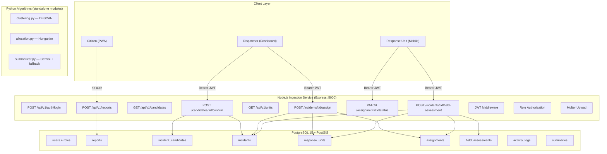
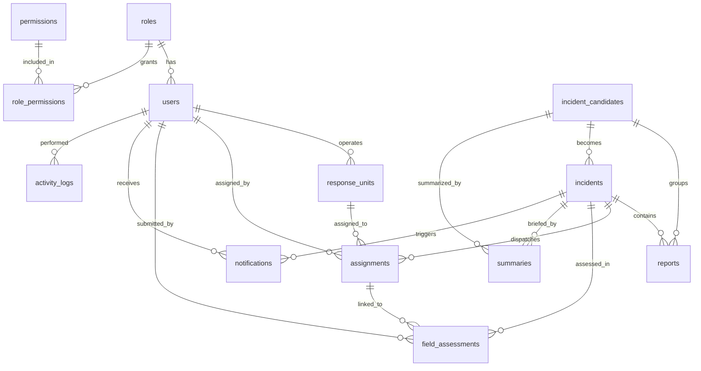
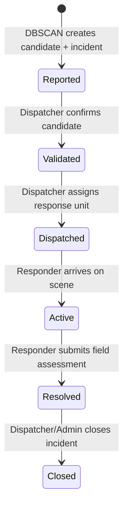

# Phase 1: Core Backend & Database Persistence — Complete

## Architecture



## Database Schema (11 tables)



## Files Delivered

### Infrastructure & Config

| File | Purpose |
|---|---|
| [`database-schema.sql`](file:///home/jay/Documents/Projects/Digital_Emergency_Reporting_and_Response_Coordination_System/database-schema.sql) | 11 tables with PostGIS geometry columns, CHECK constraints, GIST spatial indexes, and B-tree indexes |
| [`docker-compose.yml`](file:///home/jay/Documents/Projects/Digital_Emergency_Reporting_and_Response_Coordination_System/docker-compose.yml) | PostgreSQL 15 + PostGIS 3.3, RabbitMQ 3.12 with management UI, health checks, named volumes |
| [`.env`](file:///home/jay/Documents/Projects/Digital_Emergency_Reporting_and_Response_Coordination_System/.env) | All connection strings, JWT secret, algorithm thresholds, Gemini API key |
| [`seeds/02-initial-seeds.sql`](file:///home/jay/Documents/Projects/Digital_Emergency_Reporting_and_Response_Coordination_System/seeds/02-initial-seeds.sql) | Roles, permissions, seed users, sample response units |

### Node.js Ingestion Service

| File | Purpose |
|---|---|
| [`package.json`](file:///home/jay/Documents/Projects/Digital_Emergency_Reporting_and_Response_Coordination_System/services/ingestion/package.json) | Express, pg, amqplib, bcryptjs, jsonwebtoken, multer, socket.io, uuid |
| [`src/index.js`](file:///home/jay/Documents/Projects/Digital_Emergency_Reporting_and_Response_Coordination_System/services/ingestion/src/index.js) | Express app, HTTP server, Socket.IO, route mounting, DB connectivity test |
| [`src/config/db.js`](file:///home/jay/Documents/Projects/Digital_Emergency_Reporting_and_Response_Coordination_System/services/ingestion/src/config/db.js) | `pg` connection pool, `query()` helper, `testConnection()` with exit-on-fail |
| [`src/middleware/auth.js`](file:///home/jay/Documents/Projects/Digital_Emergency_Reporting_and_Response_Coordination_System/services/ingestion/src/middleware/auth.js) | JWT verification (`authenticate`), role-based access control (`authorize`) |
| [`src/middleware/upload.js`](file:///home/jay/Documents/Projects/Digital_Emergency_Reporting_and_Response_Coordination_System/services/ingestion/src/middleware/upload.js) | Multer disk storage, JPEG/PNG/WebP filter, configurable file size limit |
| [`src/routes/auth.js`](file:///home/jay/Documents/Projects/Digital_Emergency_Reporting_and_Response_Coordination_System/services/ingestion/src/routes/auth.js) | `POST /api/v1/auth/login` with bcrypt comparison and JWT issuance |
| [`src/routes/reports.js`](file:///home/jay/Documents/Projects/Digital_Emergency_Reporting_and_Response_Coordination_System/services/ingestion/src/routes/reports.js) | `POST /api/v1/reports` — citizen report ingestion with PostGIS spatial points |
| [`src/routes/candidates.js`](file:///home/jay/Documents/Projects/Digital_Emergency_Reporting_and_Response_Coordination_System/services/ingestion/src/routes/candidates.js) | `GET /api/v1/candidates`, `POST /:id/confirm` with Reported → Validated lifecycle |
| [`src/routes/incidents.js`](file:///home/jay/Documents/Projects/Digital_Emergency_Reporting_and_Response_Coordination_System/services/ingestion/src/routes/incidents.js) | `POST /:id/assign`, `PATCH /assignments/:id/status`, `POST /:id/field-assessment` |
| [`src/routes/assignments.js`](file:///home/jay/Documents/Projects/Digital_Emergency_Reporting_and_Response_Coordination_System/services/ingestion/src/routes/assignments.js) | `PATCH /:id/status` — responder toggles OnScene |
| [`src/routes/units.js`](file:///home/jay/Documents/Projects/Digital_Emergency_Reporting_and_Response_Coordination_System/services/ingestion/src/routes/units.js) | `GET /api/v1/units` — list available response units with PostGIS locations |

### Python Algorithm Modules

| File | Purpose |
|---|---|
| [`requirements.txt`](file:///home/jay/Documents/Projects/Digital_Emergency_Reporting_and_Response_Coordination_System/services/algorithms/requirements.txt) | numpy, scipy, scikit-learn, pika, psycopg2-binary, google-generativeai, python-dotenv |
| [`src/clustering.py`](file:///home/jay/Documents/Projects/Digital_Emergency_Reporting_and_Response_Coordination_System/services/algorithms/src/clustering.py) | Streaming DBSCAN with haversine metric, emergency type grouping, incremental candidate matching |
| [`src/allocation.py`](file:///home/jay/Documents/Projects/Digital_Emergency_Reporting_and_Response_Coordination_System/services/algorithms/src/allocation.py) | Modified Hungarian Algorithm with dummy matrix padding (1e6 penalty), travel time estimation |
| [`src/summarizer.py`](file:///home/jay/Documents/Projects/Digital_Emergency_Reporting_and_Response_Coordination_System/services/algorithms/src/summarizer.py) | Gemini API summarization with 2-second timeout, deterministic template fallback |
| [`tests/test_algorithms.py`](file:///home/jay/Documents/Projects/Digital_Emergency_Reporting_and_Response_Coordination_System/services/algorithms/tests/test_algorithms.py) | 12 unit tests: DBSCAN clustering, Hungarian allocation (balanced + unbalanced), summarizer templates |

## API Endpoints Summary

### Public (No Auth)
| Method | Route | Handler |
|---|---|---|
| `POST` | `/api/v1/reports` | Submit citizen emergency report with photo + GPS |
| `POST` | `/api/v1/auth/login` | Authenticate and receive JWT |

### Dispatcher (JWT Required)
| Method | Route | Handler |
|---|---|---|
| `GET` | `/api/v1/candidates` | List pending incident candidates with AI summaries |
| `POST` | `/api/v1/candidates/:id/confirm` | Confirm candidate → create incident at Validated |
| `GET` | `/api/v1/units` | List available response units |
| `POST` | `/api/v1/incidents/:id/assign` | Assign unit to incident → Dispatched |

### Response Unit (JWT Required)
| Method | Route | Handler |
|---|---|---|
| `PATCH` | `/api/v1/assignments/:id/status` | Toggle OnScene → incident becomes Active |
| `POST` | `/api/v1/incidents/:id/field-assessment` | Submit pre-hospital care report → Resolved |

## Incident Lifecycle State Machine



Each transition updates the corresponding timestamp column (`validated_at`, `dispatched_at`, `resolved_at`, `closed_at`) and logs to `activity_logs`.

## Key Design Decisions

- **Spatial storage**: All coordinates stored as `GEOMETRY(Point, 4326)` with GIST indexes for fast proximity queries.
- **Candidate → Incident flow**: Candidate confirmation creates the incident at `Reported` first, then transitions to `Validated` in the same transaction. This preserves the 6-stage lifecycle without skipping states.
- **Row-level locking**: `FOR UPDATE` locks on incidents, assignments, and units during state transitions to prevent race conditions.
- **Transactional consistency**: All multi-table writes use `BEGIN/COMMIT/ROLLBACK` with `pool.connect()` for explicit client-level transactions.
- **Field assessment gate**: Only `Active` incidents accept field assessments. Submitting one transitions the incident to `Resolved` and marks the unit as `Available`.
- **Algorithm modules standalone**: clustering.py, allocation.py, and summarizer.py have no database dependencies in Phase 1. They accept plain dicts and return results. DB wiring was deferred to Phase 2.

## Tests

12 unit tests covering all three algorithm modules:

```
test_clustering_execution_speed_under_100ms .............. ok
test_distant_reports_remain_unclustered_noise ............ ok
test_empty_reports_returns_empty_list .................... ok
test_nearby_reports_clustered_as_duplicates .............. ok
test_balanced_allocation_minimizes_total_travel_time ..... ok
test_distance_calculation_accuracy ...................... ok
test_empty_units_or_incidents_returns_empty .............. ok
test_unbalanced_more_incidents_than_units ................ ok
test_unbalanced_more_units_than_incidents ................ ok
test_empty_reports_returns_fallback_message .............. ok
test_template_detects_trapped_individuals ................ ok
test_template_handles_none_standardized_answers .......... ok

Ran 12 tests in 0.070s — OK
```
