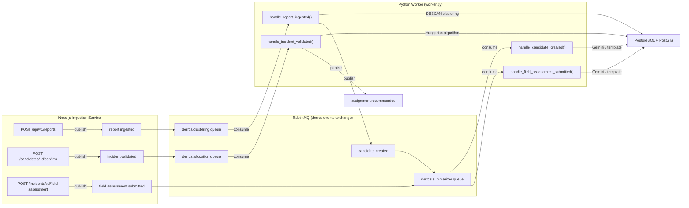

# Phase 2: Message Broker & Algorithmic Microservices — Complete

## Architecture



## Files Created (3 new)

| File | Purpose |
|---|---|
| [`rabbitmq.js`](file:///home/jay/Documents/Projects/Digital_Emergency_Reporting_and_Response_Coordination_System/services/ingestion/src/config/rabbitmq.js) | RabbitMQ connection, exchange assertion, publish helper |
| [`db.py`](file:///home/jay/Documents/Projects/Digital_Emergency_Reporting_and_Response_Coordination_System/services/algorithms/src/db.py) | PostgreSQL connection pool for Python worker |
| [`worker.py`](file:///home/jay/Documents/Projects/Digital_Emergency_Reporting_and_Response_Coordination_System/services/algorithms/src/worker.py) | Main RabbitMQ consumer with queue routing |

## Files Modified (6 existing)

| File | Changes |
|---|---|
| [`index.js`](file:///home/jay/Documents/Projects/Digital_Emergency_Reporting_and_Response_Coordination_System/services/ingestion/src/index.js) | Import and initialize RabbitMQ on startup |
| [`reports.js`](file:///home/jay/Documents/Projects/Digital_Emergency_Reporting_and_Response_Coordination_System/services/ingestion/src/routes/reports.js) | Publish `report.ingested` after DB insert |
| [`candidates.js`](file:///home/jay/Documents/Projects/Digital_Emergency_Reporting_and_Response_Coordination_System/services/ingestion/src/routes/candidates.js) | Publish `incident.validated` after confirm |
| [`incidents.js`](file:///home/jay/Documents/Projects/Digital_Emergency_Reporting_and_Response_Coordination_System/services/ingestion/src/routes/incidents.js) | Publish `field.assessment.submitted` after assessment |
| [`clustering.py`](file:///home/jay/Documents/Projects/Digital_Emergency_Reporting_and_Response_Coordination_System/services/algorithms/src/clustering.py) | Added `handle_report_ingested()` with DB integration |
| [`allocation.py`](file:///home/jay/Documents/Projects/Digital_Emergency_Reporting_and_Response_Coordination_System/services/algorithms/src/allocation.py) | Added `handle_incident_validated()` with DB integration |
| [`summarizer.py`](file:///home/jay/Documents/Projects/Digital_Emergency_Reporting_and_Response_Coordination_System/services/algorithms/src/summarizer.py) | Added `handle_candidate_created()` and `handle_field_assessment_submitted()` with DB persistence |
| [`IMPLEMENTATION_PLAN.md`](file:///home/jay/Documents/Projects/Digital_Emergency_Reporting_and_Response_Coordination_System/IMPLEMENTATION_PLAN.md) | Marked Phase 2 as completed |

## Event Flow Summary

### 1. Citizen submits report → Clustering
- `POST /api/v1/reports` saves to PostgreSQL, publishes `report.ingested`
- Python worker receives event, queries active candidates by emergency type
- If within 100m of existing candidate: attaches report, publishes `candidate.updated`
- If no match: gathers unclustered reports, runs DBSCAN, creates `incident_candidates` + `incidents` at `Reported`, publishes `candidate.created`

### 2. Dispatcher confirms candidate → Allocation
- `POST /api/v1/candidates/:id/confirm` transitions to Validated, publishes `incident.validated`
- Python worker fetches incident location and all Available units
- Runs Modified Hungarian Algorithm with dummy matrix padding (per CONTEXT.md §5.2)
- Publishes `assignment.recommended` with unit ID and estimated travel time

### 3. Candidate created → AI Summary
- `candidate.created` triggers `handle_candidate_created()`
- Queries all linked reports (description + standardizedAnswers)
- Calls Gemini API with 2-second timeout, falls back to deterministic template
- Saves `ClusterIntake` summary to the `summaries` table

### 4. Responder submits field assessment → Handover Debrief
- `POST /api/v1/incidents/:id/field-assessment` publishes `field.assessment.submitted`
- Python worker queries reports + field assessments
- Generates `HandoverDebrief` summary via Gemini or template fallback
- Saves to `summaries` table for hospital pre-arrival handoff

## Design Decisions

- **Non-blocking RabbitMQ**: The ingestion service publishes events fire-and-forget. If RabbitMQ is down, HTTP responses still succeed (the report is saved to PostgreSQL first).
- **6-stage lifecycle preserved**: Clustering creates incidents at `Reported`, not `Validated`. The dispatcher's confirm action transitions through Reported → Validated in a single transaction.
- **Emergency type filtering**: Reports only match candidates of the same emergency type (per CONTEXT.md §6.3).
- **Dummy matrix padding kept**: The Hungarian algorithm pads with 1e6 penalty values, as required by AGENTS.md Rule 2.
- **Fair dispatch**: Worker uses `prefetch_count=1` so messages are processed one at a time.

## How to Run

```bash
# Start infrastructure
docker compose up -d postgres rabbitmq

# Start Node.js ingestion service (terminal 1)
cd services/ingestion && npm run dev

# Start Python worker (terminal 2)
cd services/algorithms && source venv/bin/activate && python src/worker.py
```

## Tests

All 12 existing algorithm tests pass with zero regressions:

```
Ran 12 tests in 0.070s — OK
```
